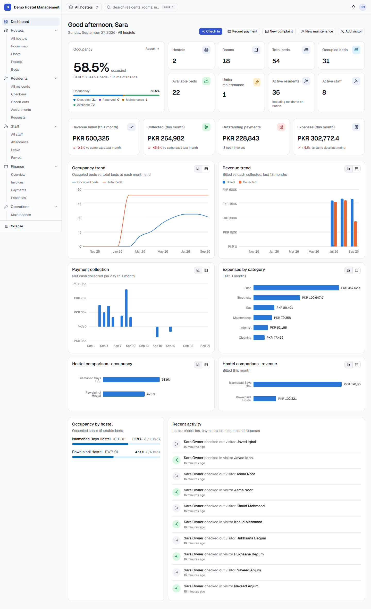
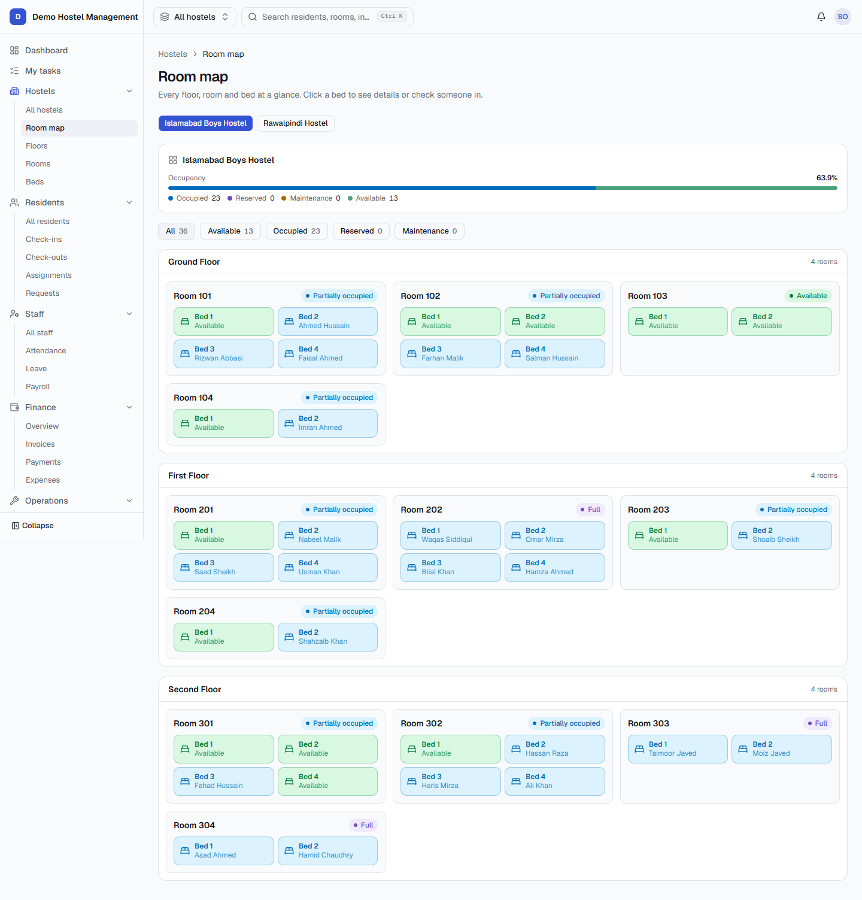
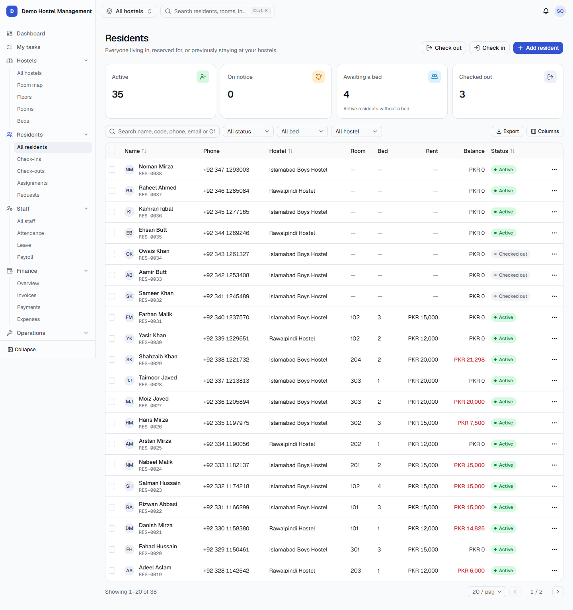
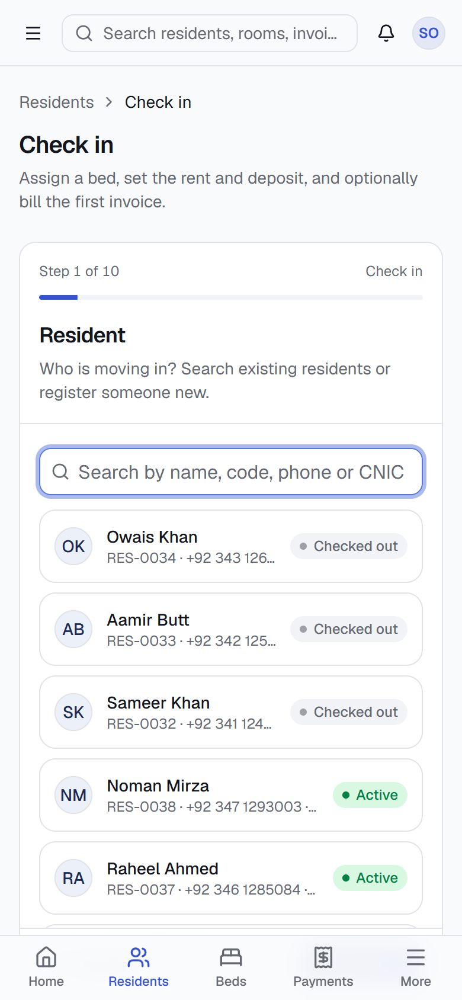
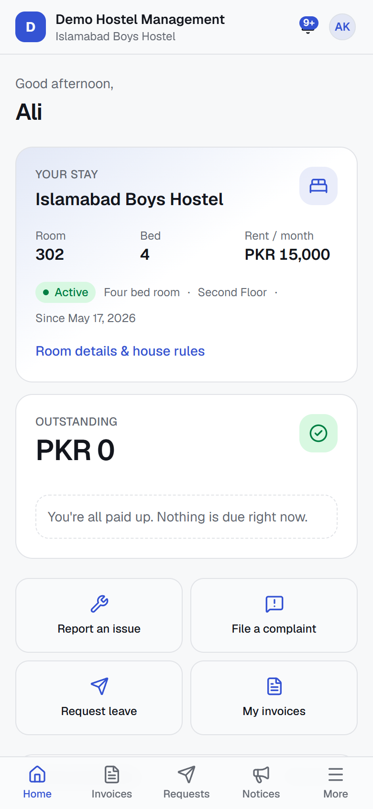

<div align="center">

# HostelHub

**Multi-tenant property management platform for hostels, rentals and property dealers. Run every property, unit, tenant, lease and payment from one place.**

[](https://nextjs.org)
[](https://www.typescriptlang.org)
[](https://www.postgresql.org)
[](https://www.prisma.io)
[](https://tailwindcss.com)
[](#testing)

[Overview](#overview) · [Features](#features) · [Quick start](#quick-start) · [Architecture](#architecture) · [Security](#security) · [Deployment](#deployment)



</div>

---

## Overview

HostelHub is a SaaS application for hostel and PG operators, landlords, property managers, and real-estate dealers. At sign-up each organization picks a **business type**: hostels, rental properties, a real-estate agency, or mixed. The app's wording and modules then adapt to it. For example, a rental business sees "Properties → Units → Tenants → Leases" instead of "Hostels → Rooms → Beds → Residents".

```
Organization → Properties (hostel, apartment building, house, plaza…) → Floors → Units / Rooms → Beds → Tenants / Residents
             → Owners (landlords whose properties you manage)
             → Listings → Leads → Viewings → Deals
             → Staff (assigned to one or more properties)
```

Hostels are one property kind among several. A property is rented either **per bed** (hostels and PGs) or as a **whole unit** (apartments, houses, portions, shops, offices).

Every organization is a fully isolated tenant. Access is controlled by granular, editable roles that can be restricted to specific hostels. The platform covers the full operating cycle:

- property setup
- check-in and check-out
- billing and collections
- staff and payroll
- day-to-day operations
- reporting
- a self-service portal for residents

## Screenshots

| Interactive room map | Residents |
| :---: | :---: |
|  |  |

| Check-in wizard (mobile) | Resident portal (mobile) |
| :---: | :---: |
|  |  |

## Features

### Property and occupancy
- Hostels, floors, rooms (with bulk creation) and beds as first-class entities
- Interactive, colour-coded room map with status filters and a bed detail drawer
- Live occupancy, calculated as occupied beds ÷ (total − maintenance − inactive), overall and per hostel
- Global hostel switcher in the header that filters every screen without signing out

### Rentals and leases
- Property kinds (hostel, apartment building, house, commercial plaza, and more) and unit types (studio, apartment, house, portion, shop, office, warehouse) with bedrooms, bathrooms, area and furnishing
- Whole-unit leases with an end date, notice period, advance rent, terms, and **automatic yearly rent increments**
- Lease renewal, a list of leases that are expiring soon, and 30- and 7-day expiry reminders from the daily job

### Owners (landlords)
- Owner records linked to the properties you manage for them, with a management-fee percentage
- Owner statements showing rent collected, expenses and management fee, and payouts tracked from pending to paid

### Sales and leasing (dealer CRM)
- **Listings** for sale or rent, with photos, price, area, location and publish status
- **Leads** in a pipeline (new → contacted → viewing → negotiating → won/lost), with an activity timeline and assigned agents
- **Viewings** scheduling, and **deals** with commission tracking from offer to closed
- A dedicated **Agent** role limited to sales and leasing

### Public listings page
- Each organization can publish a public page at `/l/<org-slug>` that lists its published listings, with a detail page for each
- Visitor enquiries become leads automatically. The form has spam protection and rate limiting

Owners, sales and leasing, and public listings are modules. Turn each one on or off under **Settings → Business**.

### Residents / tenants
- Complete resident profiles with private document storage (ID, agreement, admission form, clearance)
- Guided **check-in** and **check-out** wizards, room and bed **transfers**, and **reservations**
- Full stay history is preserved, for example "Room 101 · Bed 2, Jan–Mar → Room 205 · Bed 1, Apr–present"
- Deposit settlement at check-out (deductions, refunds, final charges) and resident requests (room change, leave)

### Billing and finance
- Invoices with line items, discounts, configurable tax, and statuses from draft to overdue
- One-click monthly rent billing with a preview step and duplicate protection
- Payments with printable receipts, advance credit, refunds, and voiding with an audit trail
- Expense tracking by category and hostel, with receipt uploads
- Finance dashboard: revenue, collections, outstanding, overdue, expenses and net income

### Staff
- Staff records assigned to one or more hostels, with documents
- Daily attendance sheet, monthly calendar and attendance percentage
- Leave requests and approvals
- Payroll with allowances, deductions and advances, plus printable payslips

### Operations
- Maintenance requests with photos, staff assignment and a status workflow
- Complaints with resolution tracking
- Visitor log with check-in, check-out and "currently inside"
- Announcements targeted at the organization, a hostel, staff or specific residents
- A "My tasks" view for front-line staff

### Insight and administration
- Owner dashboard with KPIs, occupancy and revenue trends, hostel comparison and an activity feed
- **15 reports** (occupancy, vacancy, collections, aging, profit and loss, payroll and more), each with CSV/Excel export and print-to-PDF
- Audit log with before/after values for every financial change
- Global search across residents, staff, rooms, beds, invoices, payments, complaints and maintenance
- **AI assistant** (Google Gemini): ask questions in plain language, such as "Who has overdue rent?" or "How full is the Islamabad hostel?". It answers from live data using read-only tools that run with the user's own permissions and tenant scope
- In-app notification center; email is optional and the SMS/WhatsApp channel is prepared

### SaaS platform
- Self-service sign-up and a 7-step onboarding wizard
- Team invitations and a role and permission editor
- Plans (Trial, Starter, Business, Enterprise) with enforced limits, usage meters and trials
- Billing integration behind a provider-agnostic interface
- Super-admin console for organizations, users, plans, subscriptions, feature flags and system settings, with no access to tenants' operational data
- White-label ready (logo, brand name, primary colour, custom domain), i18n ready, and prepared for RTL languages

### Resident portal
- Residents see their own room, invoices, payments and receipts, and announcements
- Mobile-first design
- Residents can submit complaints, maintenance requests and room-change or leave requests
- **Online rent payments** with JazzCash and Easypaisa, using each organization's own merchant account (see [Online payments](#online-payments))

## Tech stack

| Layer | Technology |
| --- | --- |
| Framework | Next.js 16 (App Router, Server Components, Server Actions, Route Handlers, Turbopack), React 19 |
| Language | TypeScript (strict) |
| UI | Tailwind CSS 4, shadcn/ui (Radix), Lucide icons, Recharts 3 |
| Forms & data | React Hook Form, Zod 4 (shared client/server schemas), TanStack Query 5 |
| Database | PostgreSQL 16, Prisma 7 with `@prisma/adapter-pg` |
| Authentication | Auth.js v5 (credentials), bcrypt, database-validated sessions |
| Storage | S3-compatible object storage (AWS S3, Cloudflare R2, MinIO), with a local driver for development |
| Testing | Vitest integration tests against a real PostgreSQL database, plus an end-to-end smoke test |

## Quick start

### Prerequisites

- Node.js **20.9+** (22 LTS recommended) and npm 10+
- Docker Desktop, for the local PostgreSQL instance. Any PostgreSQL 14+ server also works.

### Setup

```bash
git clone https://github.com/Usmanpir/HostelsHubPortal.git
cd HostelsHubPortal

npm install                 # installs dependencies and generates the Prisma client
cp .env.example .env        # then set AUTH_SECRET (npx auth secret) and CRON_SECRET

npm run db:up               # starts PostgreSQL 16 on localhost:5440 and creates the test database
npm run db:migrate          # applies the database migrations
npm run db:seed             # loads the demo organization (development only)
npm run dev                 # http://localhost:3000
```

### Demo accounts

The development seed creates a demo organization, **Demo Hostel Management**, with two hostels, 50+ beds, residents, staff, three months of invoices and payments, expenses, attendance, payroll and operational records. It also creates a second, separate organization for testing tenant isolation.

All demo accounts use the password **`Demo@12345`**.

| Role | Email | Scope |
| --- | --- | --- |
| Owner | `owner@demo-hostels.dev` | Everything in the organization |
| Admin | `manager@demo-hostels.dev` | All hostels |
| Accountant | `accounts@demo-hostels.dev` | Finance only, no resident management |
| Hostel manager | `islamabad.manager@demo-hostels.dev` | Islamabad Boys Hostel only |
| Receptionist | `reception@demo-hostels.dev` | Rawalpindi Hostel only |
| Warden | `warden@demo-hostels.dev` | Islamabad Boys Hostel only |
| Staff | `staff@demo-hostels.dev` | "My tasks" view |
| Resident | `resident@demo-hostels.dev` | Resident portal (`/portal`) |
| Super admin | `admin@hostelhub.dev` | Platform console (`/admin`) |
| Other tenant | `owner@other-tenant.dev` | A separate organization |

The seed also creates **Demo Property Group**, a mixed rental and real-estate organization. It has two landlords and three properties: an apartment building, a house split into portions, and a shop plaza. It also has tenants on leases (two expire soon), invoices, listings, leads, viewings and deals. Its public page is at [`/l/demo-property-group`](http://localhost:3000/l/demo-property-group).

| Role | Email | Scope |
| --- | --- | --- |
| Owner | `property@demo-rentals.dev` | Everything in Demo Property Group |
| Agent | `agent@demo-rentals.dev` | Listings, leads, viewings and deals only |

To recreate the property demo from scratch, run `npx tsx --conditions=react-server scripts/reset-property-demo.mts`, then `npm run db:seed`.

> [!WARNING]
> These credentials are for local development only. The seed refuses to run when `NODE_ENV=production`.

## Configuration

Copy `.env.example` to `.env`. All variables are documented there.

| Variable | Required | Description |
| --- | --- | --- |
| `DATABASE_URL` | Yes | PostgreSQL connection string |
| `TEST_DATABASE_URL` | For tests | Separate test database (its name must contain `test`) |
| `AUTH_SECRET` | Yes | Session signing secret. Generate with `npx auth secret` |
| `NEXTAUTH_URL` / `AUTH_URL` | Production | Public base URL of the app |
| `AUTH_TRUST_HOST` | Non-Vercel hosts | Set to `true` when running behind a trusted reverse proxy |
| `NEXT_PUBLIC_APP_URL` | Yes | Base URL used in emails (invitations, password resets) |
| `NEXT_PUBLIC_APP_NAME` | No | Platform brand name (default `HostelHub`) |
| `STORAGE_DRIVER` | Yes | `local` (development only) or `s3` |
| `STORAGE_ENDPOINT` · `STORAGE_REGION` · `STORAGE_ACCESS_KEY` · `STORAGE_SECRET_KEY` · `STORAGE_BUCKET` | When `s3` | S3-compatible bucket, which must be **private** |
| `STORAGE_MAX_FILE_MB` | No | Maximum upload size (default `10`) |
| `EMAIL_SERVER` | Production | SMTP URL. If empty, emails are written to the server console |
| `EMAIL_FROM` | Production | Default sender address |
| `REQUIRE_EMAIL_VERIFICATION` | No | Set to `true` to require a verified email before sign-in |
| `CRON_SECRET` | Production | Bearer token that protects `/api/cron/daily` |
| `SALES_EMAIL` | No | Inbox for "Book a demo" requests (defaults to `EMAIL_FROM`) |
| `GEMINI_API_KEY` | No | Enables the in-app AI assistant. A free key is available from [Google AI Studio](https://aistudio.google.com/apikey). If empty, the assistant shows as unavailable |
| `GEMINI_MODEL` | No | Gemini model for the assistant (default `gemini-flash-latest`) |
| `PAYMENTS_ENCRYPTION_KEY` | Production, if online payments are used | 32-byte base64 key (`openssl rand -base64 32`) that encrypts gateway credentials. If unset, a key is derived from `AUTH_SECRET`. Keep it stable |
| `PAYMENTS_SIMULATOR` | No | `true` enables the local payment simulator. Ignored when `NODE_ENV=production` |

## Scripts

| Command | Description |
| --- | --- |
| `npm run dev` | Start the development server |
| `npm run build` | Generate the Prisma client and create a production build |
| `npm start` | Serve the production build |
| `npm run lint` | Run ESLint |
| `npm run typecheck` | Generate route types and run the TypeScript compiler |
| `npm test` | Run the integration test suite |
| `npm run db:up` | Start the local PostgreSQL container |
| `npm run db:migrate` | Create and apply migrations (development) |
| `npm run db:deploy` | Apply migrations (production / CI) |
| `npm run db:seed` | Load demo data (development only) |
| `npm run db:studio` | Open Prisma Studio |
| `node scripts/smoke.mjs` | End-to-end smoke test of every role against a running, seeded server (`BASE_URL=http://localhost:3000`) |

## Architecture

### Request flow

```
Page (Server Component) ─┐
Server Action ───────────┼──▶ Service layer ──▶ Prisma ──▶ PostgreSQL
REST Route Handler ──────┘    (validate · authorize · tenant-scope · transact · audit)
```

Pages, actions and API routes are deliberately thin. All business logic lives in `src/services/**`, and that is the only layer that talks to the database. Each service call does the following:

1. Validates input with a Zod schema shared with the client form.
2. Checks a permission.
3. Scopes every query to the caller's organization and hostels.
4. Runs mutations inside a transaction.
5. Writes an audit entry.
6. Returns serialized data.

### Project structure

```
src/
├── app/
│   ├── (marketing)/        Landing page
│   ├── (auth)/             Sign in, sign up, password reset, email verification
│   ├── onboarding/         7-step setup wizard
│   ├── invite/[token]/     Invitation acceptance
│   ├── (app)/              Authenticated workspace: dashboard, hostels, residents, staff,
│   │                       finance, operations, reports, audit log, settings, tasks, account
│   ├── portal/             Resident portal
│   ├── admin/              Super-admin console
│   └── api/                REST endpoints for every module, plus files, search, notifications and cron
├── services/               Business logic, one folder per domain
├── lib/                    auth · db · tenant · permissions · validation · storage ·
│                           notifications · subscription · security · i18n
├── components/             ui (shadcn) · shared · forms · data-table · layout · per-module components
└── config/                 Navigation, enum labels, plans and defaults
prisma/                     Schema, migrations and the demo seed
tests/                      Integration tests
docs/CONVENTIONS.md         Guide for adding a new module
```

### Multi-tenancy

- Every tenant-owned table carries `organizationId`. Hostel-owned tables also carry `hostelId`, and tenant-scoped queries are backed by composite indexes.
- On every request, the server builds a `TenantContext` from the **authenticated user and the database**. It contains the organization, role permissions, accessible hostels and the active hostel.
- Cookies hold only preferences, such as the selected organization or hostel. These are validated against the user's memberships.
- Organization IDs, roles and hostel IDs are **never trusted from the client**. A record from another tenant returns **404**, so the platform never confirms that such a record exists.
- Files are private. They are stored under organization-prefixed keys and served only through `/api/files/[id]` after an authorization check.

### Access control

- **Organization roles** are templates copied into each organization: Owner, Admin, Accountant, Hostel Manager, Receptionist, Warden and Staff. Owners can edit them and create custom roles.
- The code checks **permission keys**, never role names.
- **Hostel scope** gives a member either access to all hostels or access to an explicit list. Hostel-level staff can only read and write records in their own hostels.
- **Residents** use the portal, where every query is bound to their own record.
- **Super admins** manage the platform but have no implicit access to tenant data.
- The UI hides actions a user can't perform, and the server enforces every check again independently.

### Business rules

These rules are enforced in the service layer and, where possible, by database constraints:

| Rule | Enforcement |
| --- | --- |
| A bed holds at most one active resident | Unique `activeBedId` on assignments, plus a row lock during check-in and transfer |
| A resident has at most one active stay | Unique `activeResidentId` on assignments |
| Rooms never exceed capacity | Checked on bed creation and on check-in |
| Payments never exceed the invoice balance | Invoice row lock. Any excess is recorded as advance credit, and only when the user explicitly chooses to |
| Financial records are never deleted | Invoices are cancelled and payments and expenses are voided, each with a reason and a before/after audit entry |
| History survives archiving | Archived residents and hostels still appear in reports |
| Plan limits are enforced | Hostels, beds, residents, staff and storage are checked whenever a record is created |

## Online payments

Residents can pay an invoice's remaining balance from the resident portal (**Pay online** on the invoice and on the portal home). Each organization connects **its own** JazzCash and/or Easypaisa merchant account under **Settings → Online payments** (permission `settings.organization`), so the money settles directly with the hostel. Both gateways only accept PKR.

**JazzCash (Page Redirection v1.1).** In the JazzCash sandbox portal, copy the Merchant ID, Password and Integrity Salt into the settings screen. Register the return URL `${NEXT_PUBLIC_APP_URL}/api/payments/online/jazzcash/return` as your Return URL, because JazzCash rejects checkouts whose return URL doesn't match. Requests and responses are signed with HMAC-SHA256 (`pp_SecureHash`). Stale payments are re-checked through the Payment Inquiry API.

**Easypaisa (Easypay hosted checkout).** Enter the Store ID, your Easypaisa account number, the 16-character Hash Key (Merchant Portal → Account Settings) and the web-service username and password. Use `${NEXT_PUBLIC_APP_URL}/api/payments/online/easypaisa/return` as the post-back URL. Add `${NEXT_PUBLIC_APP_URL}/api/payments/online/easypaisa/ipn` under IPN Attribute Configurations. Easypaisa's browser post-back is not signed, so every payment is confirmed with the Inquire Transaction API before it is recorded.

Start in **Sandbox**, complete a test payment end to end, then switch to **Live** with production credentials. Use **Test connection** to check the credentials against the gateway.

**Local development.** Set `PAYMENTS_SIMULATOR=true` to add a "Test payment" option. It opens `/portal/payments/simulator` with Approve, Decline and Cancel buttons. The result is posted to the same return route with a server-generated HMAC, so the full completion path runs without merchant accounts. The simulator can't be enabled in production.

**How it stays safe**

- Credentials are encrypted with AES-256-GCM and are write-only in the UI. Audit entries record which secret changed, never its value.
- Return and IPN routes take no session and have no CSRF check, because the gateway calls them. A payment is recorded only after a signature check or a server-side inquiry. Amounts and statuses sent by the browser are never trusted.
- Completion is idempotent: the `OnlinePayment` row is locked, and `paymentId` is unique. A replayed or concurrent callback can't create a second payment.
- The amount must match what was charged. On success a normal `Payment` (method `ONLINE`) is recorded through the same ledger code as cash payments. If the invoice was settled in the meantime, the money is kept as advance credit.
- The daily job (`/api/cron/daily`) reconciles stale pending payments and expires abandoned ones.
- Staff see online payments as regular receipts labelled "Online (JazzCash)", plus every attempt under **Finance → Payments → Online attempts**.

## Security

- **Authentication:**
  - Passwords are hashed with bcrypt (cost 12).
  - Login takes the same time for unknown emails, and accounts lock after repeated failures.
  - Sessions are revocable and are re-validated against the database on every request.
- **Rate limiting:** backed by the database, applied to sign-in, registration, password reset, uploads and API writes.
- **Request integrity:**
  - Origin checks on every write request (CSRF protection).
  - Zod validation on all server input.
  - Parameterized SQL through Prisma.
  - Output escaped by React.
- **Uploads:** file types are detected from the file contents (magic bytes), with size limits, per-plan storage quotas, random object keys and private storage.
- **HTTP hardening:** HSTS, frame denial, `nosniff`, and referrer and permissions policies. Stack traces never reach the client.
- **Exports:** CSV and Excel output is sanitized against formula injection.

## Testing

```bash
npm run db:up   # the test database is created automatically alongside the dev database
npm test
```

The integration suite has 50 tests. It runs against a dedicated PostgreSQL test database: migrations are applied automatically and every test creates its own isolated tenants. It covers:

- **Tenant isolation:** explicit cross-tenant attacks using another organization's IDs
- **Access control:** role permissions, hostel scoping, accountant restrictions and staff permissions
- **Residents:** creation, check-in, transfer, check-out and archiving
- **Concurrency:** two simultaneous check-ins to the same bed, and simultaneous payments against one invoice
- **Finance:** invoice totals and tax, payments, advance credit, voiding and expenses
- **Authentication:** registration, password changes and session invalidation, and rate limiting

For an end-to-end check of the running app, start the server with the demo data loaded and run `node scripts/smoke.mjs`. It signs in as every demo role, loads each role's pages and confirms that forbidden pages and other tenants' records are blocked.

## Deployment

HostelHub is ready for Vercel and also runs on any Node.js host.

1. Provision a PostgreSQL database (for example Neon, Supabase or Amazon RDS) and a **private** S3-compatible bucket.
2. Configure the environment variables listed above: `STORAGE_DRIVER=s3`, the SMTP settings and `CRON_SECRET`.
3. Deploy. The build command is `npm run build`.
4. Apply migrations to the production database with `npm run db:deploy`, from CI or as a release step. Never run the seed in production.
5. `vercel.json` schedules `/api/cron/daily`. It marks overdue invoices, sends rent-due reminders and publishes scheduled announcements.
6. Create the first platform administrator: register an account, then set `isSuperAdmin = true` on that user in the database.

## Extending the platform

The integrations are behind small interfaces, so adding a provider doesn't require changes elsewhere:

| Extension point | Interface |
| --- | --- |
| SMS / WhatsApp notifications | `NotificationChannel` in `src/lib/notifications/channels.ts` |
| Card payments (Stripe, Paddle, …) | `BillingProvider` in `src/lib/subscription/provider.ts` |
| File storage backends | `StorageProvider` in `src/lib/storage/types.ts` |
| Additional languages | `src/lib/i18n/messages/<locale>.ts`. Text direction (LTR/RTL) follows the locale |

See [docs/CONVENTIONS.md](docs/CONVENTIONS.md) for the patterns to follow when adding a module.

## Roadmap

- Online rent payments through a payment provider
- SMS and WhatsApp notification channels
- Urdu and Arabic translations
- QR-code and biometric attendance, and smart-lock integration
- Native mobile app

## License

No license has been chosen yet. Until one is added, all rights are reserved by the author.
